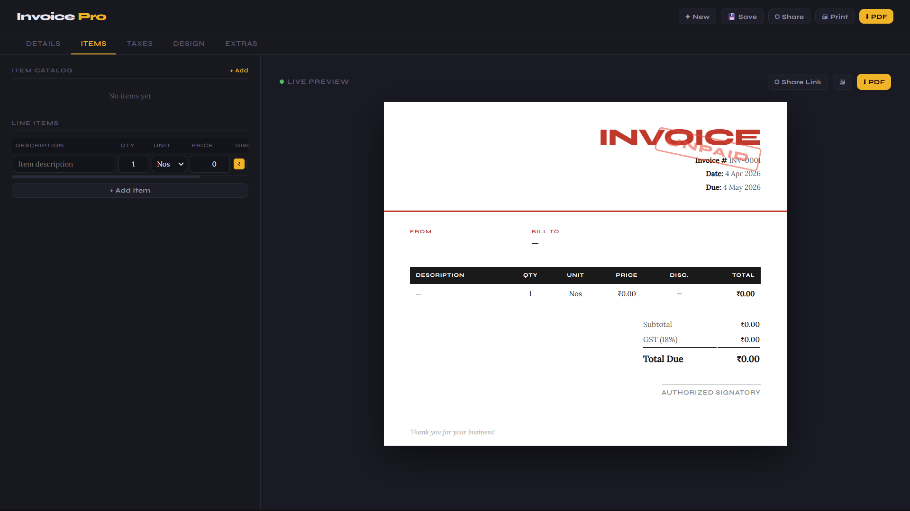
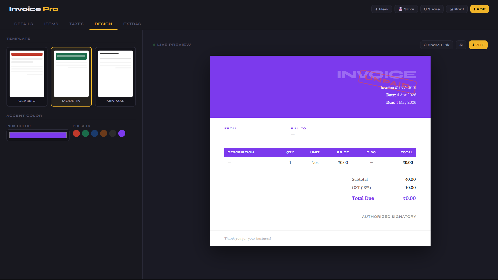
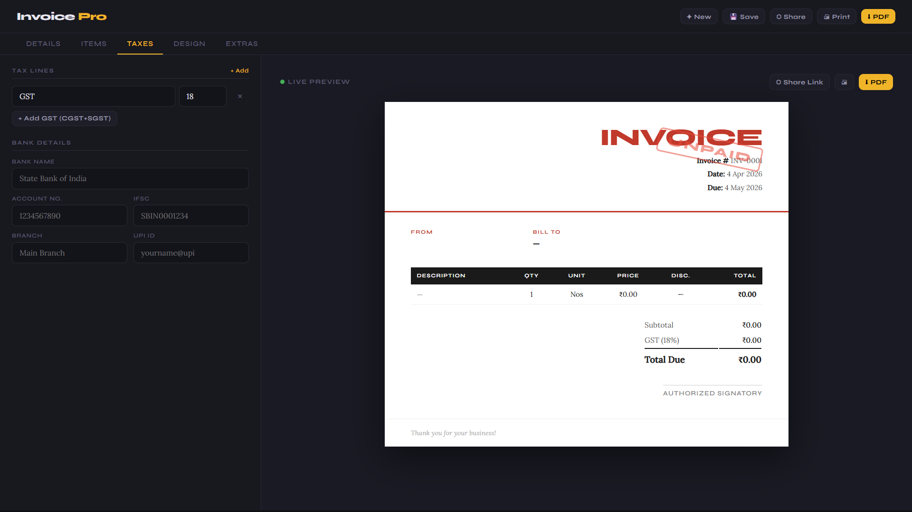
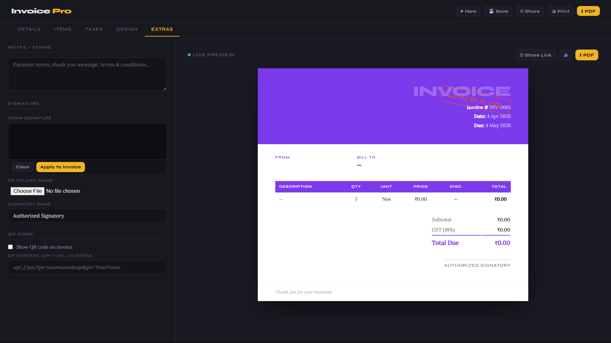
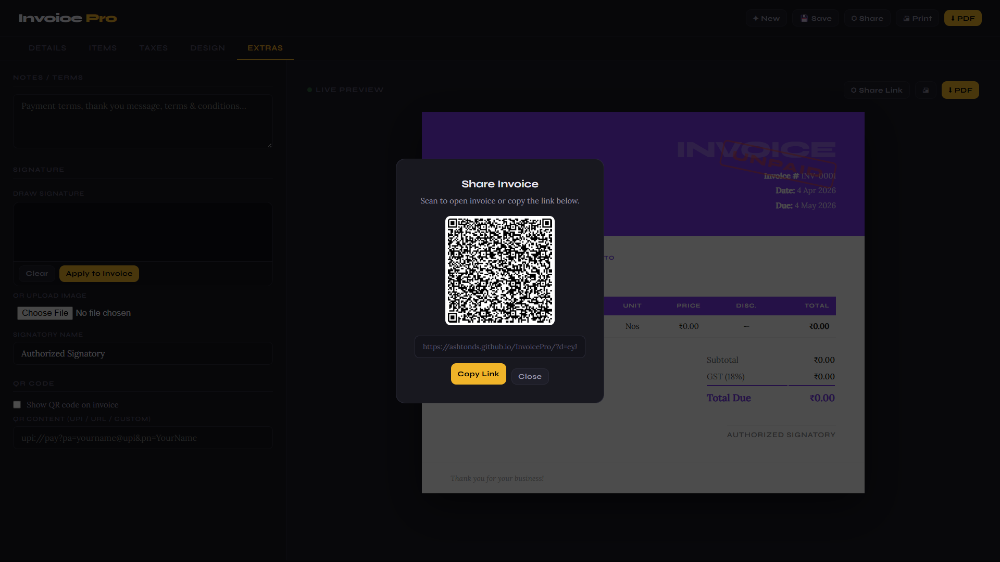

<h1 align="center">💻✨ InvoicePro</h1>

<p align="center">
  <b>Smart Invoice Generator • Fast • Clean • Professional</b>
</p>

<p align="center">
  
</p>

<p align="center">
  
  
  
  
  
</p>

---

## 🚀 About the Project

**InvoicePro** is a modern invoice generator that helps you create professional invoices in seconds — with automatic calculations for totals, discounts, and taxes, all wrapped in a clean and intuitive UI.

<p align="center">
  <a href="https://ashtonds.github.io/InvoicePro/">
    
  </a>
</p>

---

## 🎥 Preview


<table align="center">
  <tr>
    <td></td>
    <td></td>
  </tr>
  <tr>
    <td></td>
    <td></td>
  </tr>
  <tr>
    <td></td>
    <td></td>
  </tr>
</table>
---

## ✨ Features

| Feature | Description |
|---|---|
| ⚡ Fast Invoice Generation | Create professional invoices in seconds |
| 📄 PDF Download | Export your invoice as a PDF instantly |
| 💰 Tax & Discount Calculation | Auto-calculated totals, taxes, and discounts |
| 👤 Customer Details | Add and manage client information |
| 🎨 Clean UI | Minimal, distraction-free interface |
| 📱 Responsive Design | Works seamlessly on all screen sizes |

---

## 🛠️ Tech Stack

<p align="center">
  
</p>

---

## 🧠 Workflow

```text
User Fills Form → Items & Client Details Added
↓
Auto Calculation → Tax, Discount, Total
↓
Preview Invoice → Clean Formatted Layout
↓
Download as PDF → Ready to Send
```
---
## 📂 Project Structure
```text
InvoicePro/
│── index.html       # Main UI
│── assets/          # Images & icons
```
---

## 🚧 Roadmap

- [ ] 🔐 Login & user accounts
- [ ] ☁️ Cloud storage for saved invoices
- [ ] 📊 Analytics dashboard
- [ ] 🌍 Multi-language support
- [x] 🎨 Custom invoice themes
- [x] 💵 UPI integration

---

## 🤝 Contributing

Contributions are welcome! Here's how to get started:

1. **Fork** the repository
2. **Clone** your fork — `git clone https://github.com/your-username/InvoicePro.git`
3. **Create** a branch — `git checkout -b feature/your-feature`
4. **Commit** your changes — `git commit -m 'Add some feature'`
5. **Push** to your branch — `git push origin feature/your-feature`
6. **Open** a Pull Request 🚀

---

## 👨‍💻 Author

<p align="center">
  <a href="https://github.com/ashtonds">
    
  </a>
</p>

---

## 💙 Support

If you found this project helpful, please consider giving it a ⭐ — it really helps!

<p align="center">
  
</p>
